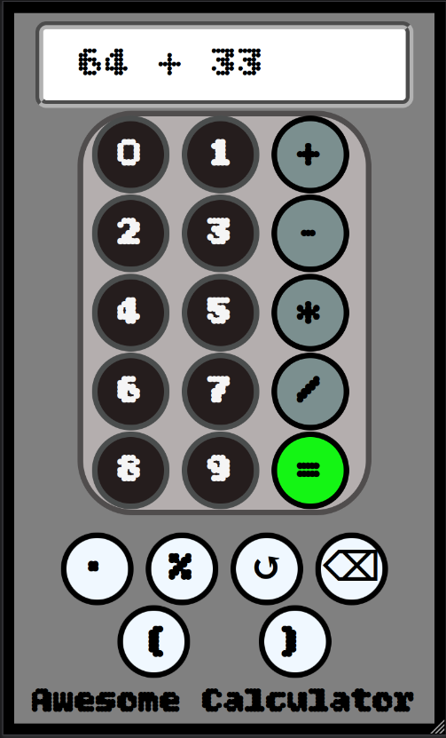

# Calulator Web Application 
This is a web application coded in HTML, CSS, and Javascript in which it is a simple calculator program with a graphical user interface. For this project, I wanted to combine all of the World Wide Web languages into something I am proud of, and there is no better start than the simplest tool for mankind...a number cruncher. With regards to the front-end development, I wanted to test the `grid` and `flex` layouts in CSS as well as hone my element structure in HTML. In the back-end process,the goal was make the event listeners reponsive to user input, and practice DOM (Document Object Model) manipulation.

## Front-End

### 1. HTML
To begin with, I decided that the main grid layout of the page, the one to keep it all together, would be `flex`. Doing so would allow me to stack the page into a neat column using the `column nowrap` value. This ensures responsivness and a consistent display for most screen types. Continuing off the intitial design plan, the inspiration for this design was of course, a regular calculator. With any basic Texas Instrument or Analog Device, the design pattern is similiar; the screen on top, and buttons on the bottom where the button types (function/number/operators) can differ. Using HTML, I reflected this pattern using the basic structure below.
```html
<input type="text" class="user__input" readonly>

<main class="main__calculator">

    <section class="user__buttons">
        <section class="button__selection">

        </section>
    </section>

    <section class="misc__input">

    </section>

</main>
```
As we can see, the top of the structure is the screen of class `.user__input`. This captures the input of the user made by pressing on the buttons. The latter is denoted by the `.user__buttons` class in which it houses `.buttons__selection`. The rest of the buttons under class `.misc__input` are meant for other miscellanous operators. What holds all the buttons together is the `.main__calulator` class. This calculator is simple, and I decided to forgo complex functions as such logartihms, trigonometry, and the like. 

### 2. CSS
With every CSS stylesheet I create, I start with a CSS reset whereby I set the default `margin ` and `padding` to 0 as well as set the box sizing to `border-box`. 
```css
* {
  margin: 0;
  padding: 0;
  box-sizing: border-box;
  font-family: "Bitcount", system-ui;
}
```
This ensures that there are no default operations done whenever I create a new box element such implicitly adding padding, furthermore,  the `border-box` value is essential to prevent content from clipping through the set borders. Once that is done, I proceed to declare `body`, `.main__calculator`, and `.user__buttons` as diplays of `flex` whose content is justified to `column nowrap`. Now, let's circle back to the design of the simple calculator. Yes, the input screen and buttons are stacked on eachother, however, this doesn't hold for the buttons themselves. Upon a closer look, the buttons are arranged to have columns and rows. This allows me to conclude that I must utilize the `grid` display in CSS. A `grid` display will allow me to create as many columns and rows as I want, which is perfect for numbers and operators. In the basic HTML structure I provided, we see that the class `.user__buttons` houses the class `.button__selection`, and that is where `grid` will be utilized.
```css
.button__selection {
  display: grid;
  grid-template-columns: repeat(3, 32.2%);
  grid-auto-rows: 20.34%;
  place-content: center;
  margin-left: 1.5%;
}
```
Creating the buttons section as `grid` makes it easier to manipulate each individual button into a desirable position. Finally, in order for better responsive design, I implemeted a media screen whenver a phone is in landscape mode. 
```css
@media screen and (orientation: landscape) {
  .main__calculator {
    flex-flow: row nowrap;
  }

  .user__selection {
    flex-flow: row nowrap;
    height: 60.2vh;
    margin-left: 5%;
  }

  .box {
    font-size: 2rem;
    width: 45.5px;
    height: 45.5px;
  }

  .button__selection {
    grid-template-columns: repeat(3, 50.2%);
    grid-auto-rows: 20.34%;
    place-content: center;
    margin-left: 8.5%;
  }

  .misc__input {
    flex-flow: column wrap;
    width: 79.34vw;
    height: 60vh;
    align-items: center;
    gap: 5px;
  }

  .misc__input > .box{
    width: 60.5px;
    height: 60.5px;
  }

}
```
Here, I changed the flex displays that were once `column nowrap` to `column wrap` to allow wrapping when the content goes out-of-bounds. Also, I chose to change the layout of classes `.main__calculator` and `.user__selection` to `row nowrap` in order to fill the phone screen when the orientation is in landscape. 

## Back-End

### 1. Javascript
The backend design is simple for this equally simple project; a button is pressed and the screen is updated. Similar to a regular calculator, my web calculator will follow a pattern of listening when a button is pressed, and updates the value of the screen until the user presses the `=` button. With every web project using Javascript, I begin by instantiating my document selectors.
```js
let input = document.querySelector("input");
const boxes = document.querySelectorAll(".box");
const numbers = document.querySelectorAll(".number");
const operators = document.querySelectorAll(".operator");
const equal_btn = document.getElementById("=");
const reset_btn = document.getElementById("reset");
const delete_btn = document.getElementById("delete");
```
The main variables of concern for this program will be the `input `, `equals_btn`, `reset_btn`, and `delet_btn` as they perform specfic functions. `input` is resonsible for showing the user input in which I will be using it as a string. Whenever a button is pressed, the value of the button is concatinated as a character into the `input` string. Since we are concatinating, it is crucial to keep in mind the spaces of each character. 

#### 1. For Operators
```js
input.value += ' ' + operate.id + ' ';
```

#### 2. For Numbers
```js
input.value += number.id;
```

When operators are pressed, the operator will add a space before and after. While operator placement does not matter for computation, I chose to add the extra spaces to make the input screen more presentable to the eye. When numbers are pressed, the value will be concatinated into the input screen as a string. Once the user presses the `=` button, the input of the screen will be evaulated by the `Function()` class. 
```js
const final_answer = new Function("return " + input.value.trimEnd().slice(0, -1))();
```
Once the arithmetic is computed, the value of the screen will be replaced by the final answer, and all other buttons except `reset_btn` will be disabled. 
```js
boxes.forEach((element)=>{
  if (element.id !== "reset") {
    element.disabled = true;
  }
});
```

It is important to note here that the `boxes` variable is a container for all buttons. 

## Showcase

### Portrait Mode


### Landscape Mode


